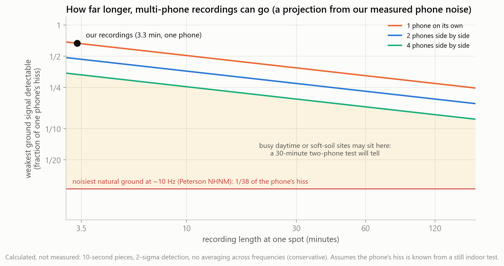
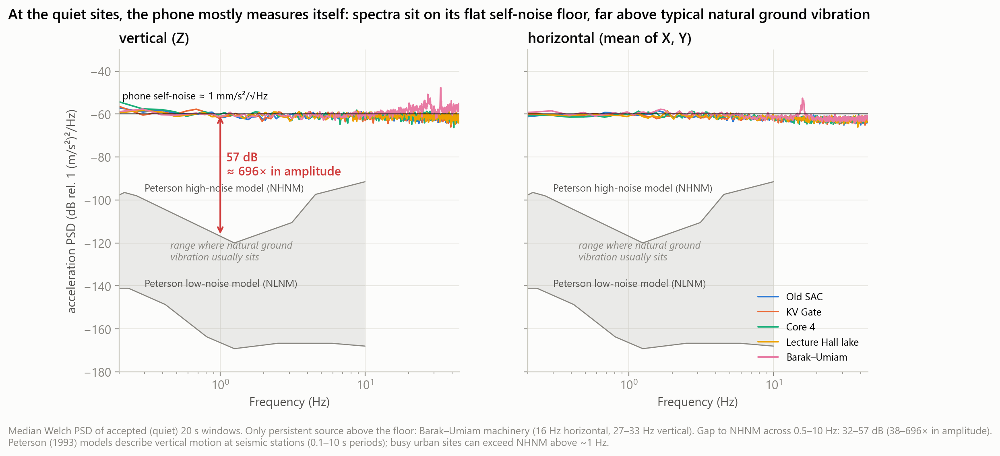
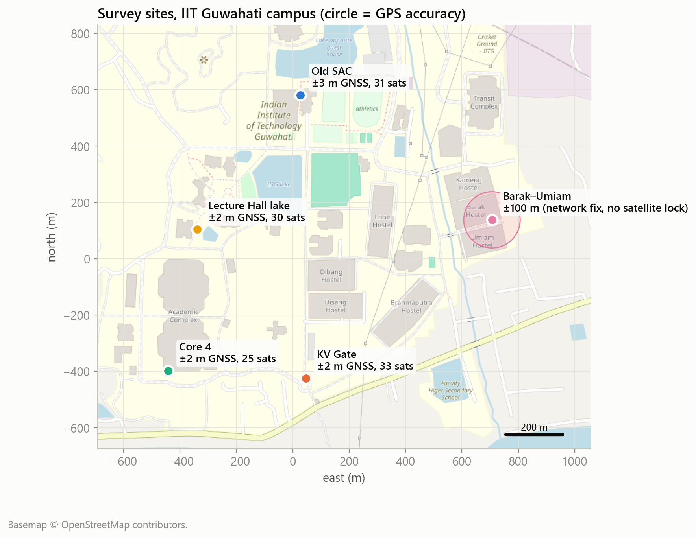

# Listening to the ground beneath IIT Guwahati

**Can an ordinary phone tell which parts of a campus sit on softer ground that would shake harder in an earthquake?**

We took one phone to five spots on the IIT Guwahati campus, recorded the ground's constant tiny trembling, and built an analysis pipeline to find each spot's natural "rhythm", the number engineers use to spot soft, risky ground. This repository has everything a judge or engineer needs to check our work: the code, the data, a sample in plain CSV, the schema, and the full data documentation.

*Team: Ayush Agarwal · Vipul Sharma · Granica × IIT Guwahati Hackathon, "Bring the Physical World to AI" (September 2026)*

| | |
|---|---|
| Slides (3 pages) | [presentation/slides.pdf](presentation/slides.pdf) |
| Demo video (30 s) | [presentation/demo_video.mp4](presentation/demo_video.mp4) |
| Data documentation | [DATA.md](DATA.md): row counts, collection window, sources, observed vs inferred vs synthetic, how AI was used |
| Schema | [SCHEMA.md](SCHEMA.md): every file and every column |
| Data sample | [data/sample/](data/sample/): plain CSV, opens in Excel |

---

## 1. The problem, in one minute

- **The risk.** Assam is in India's highest earthquake-risk zone. The 1897 earthquake turned parts of Guwahati's riverside soil to slush.
- **Why the ground matters.** When an earthquake hits, soft, deep soil (like the sand and clay the Brahmaputra has laid down) traps the shaking and makes it stronger. Firm rock passes it on. Two identical buildings can suffer very differently depending on what they stand on.
- **The gap.** Every patch of ground has a natural rhythm it likes to sway at. Soft, deep soil sways slowly; firm ground sways quickly. Knowing that rhythm for each part of campus would tell the Estate Office where new buildings need the most careful foundations, and where expensive soil drilling (₹5,000–15,000 per metre) is most worth paying for. Nobody has measured it spot by spot across the campus.
- **The idea.** Geologists can find this rhythm without drilling, using a method called **H/V** (horizontal-to-vertical ratio; Nakamura, 1989). The ground is never still: traffic, wind and footsteps keep it trembling by amounts far too small to feel. Divide the sideways trembling by the up-and-down trembling, and the rhythm where that ratio peaks is the ground's natural rhythm. Every phone has a motion sensor, so we asked: **can a phone do this?**

## 2. What we found

1. **The method worked end to end.** Recording, cleaning, checking and scoring all ran automatically across five spots and 15 recordings.
2. **The phone captured real vibration.** It recorded footsteps and passers-by, and a pump switching on near the Barak and Umiam hostels (steady tones at 16 and 27–33 vibrations per second).
3. **It gave usable numbers.** At night, every spot vibrated at most about 80 µm/s, below the vibration limit used for hospital operating theatres. That is useful for deciding where to put microscopes, scanners or other sensitive equipment. We also measured the phone's own noise level (the same at every spot), which the next round of recordings can be planned around.
4. **The ground's slow rhythm was out of reach in this first round.** On a quiet night, in 3½-minute recordings, the phone's own electronic hiss was **38 to 696 times louder** than natural ground trembling (compared with the worldwide reference levels of Peterson, 1993). So none of the five spots gave a trustworthy ground rhythm *yet*, and our pipeline says so instead of guessing.
5. **We caught our own mistake.** An early version reported a rhythm of "5.2 per second" at one spot. It was a random spike in unsmoothed noise. The finished pipeline smooths the data the standard way and refuses to report a rhythm unless the ground signal is clearly above the phone's hiss.
6. **An AI check agrees.** A model trained to tell the five spots apart by their vibration recognised the spot with the pump. In the rhythms that matter for buildings it scored 21%, close to guessing (20%), confirming the phone was not yet hearing ground differences.

### How far longer recordings can go

Longer recordings don't make the phone quieter, but they make its hiss steady enough that a fainter ground signal can be picked out on top of it. Recording with several phones side by side also lowers the hiss. Working from our measured noise level (a projection, not a measurement):

| Setup | Weakest ground signal the phone can pick out |
|---|---|
| Today: one phone, 3½ minutes | about 0.67 × its own hiss |
| One phone, 30 minutes | about 0.39 × |
| One phone, 2 hours | about 0.27 × |
| Four phones side by side, 2 hours | about 0.14 × |

The noisiest natural ground is about 1/38 of the hiss at the faster rhythms, and far quieter at slow ones. So longer, multi-phone recordings could plausibly reach busy daytime spots or soft riverside ground at the faster rhythms. The quietest ground at slow rhythms still needs a proper sensor. A 30-minute daytime test with two phones side by side will show where campus actually sits.



**What comes next:**
1. 30-minute daytime recordings with two phones side by side at the riverside spot, the cheapest next step.
2. The same routine with a proper geophone sensor (for example a Raspberry Shake, about ₹50,000–1.2 lakh) at dozens of spots.
3. An AI model trained on those readings and the boreholes campus already has, to map soft ground across the whole campus and point to where the next borehole is worth drilling.



## 3. How the data was collected

We used **phyphox**, a free physics app from RWTH Aachen University, on one phone (vivo V2545). At each of the five spots we ran three recordings, always in the same order:

| Step | phyphox tool | What it records | Why |
|---|---|---|---|
| 1 | Acceleration (without g) | Shaking in three directions, about 100 times a second, for 3–3½ minutes, with the phone flat on bare ground and untouched | The main measurement |
| 2 | Location (GPS) | Latitude, longitude and accuracy for about 30 seconds | Ties each recording to a place |
| 3 | Inclination | How level the phone was, for about 20 seconds | A tilted phone mixes up sideways and up-and-down shaking |

All five spots were recorded on **26 September 2026, between 7:57 pm and 10:49 pm**. We chose night on purpose: the ground is quietest then, which makes it the hardest test for a phone. That gave **15 recordings and 100,212 vibration readings**. Full details are in [DATA.md](DATA.md).



## 4. How the analysis works (plain language)

The pipeline is [scripts/hvsr_pipeline.py](scripts/hvsr_pipeline.py). For every spot it does the following:

1. **Finds the files.** Recordings were renamed by hand in the field (for example "accelaration" and "ocation (GPS)"), so the code recognises each file by keywords rather than exact names. A new spot is added by dropping its three zip files into `data/raw/`.
2. **Removes the moments we disturbed the phone.** It drops the first and last 5 seconds (placing and picking up the phone). It also drops any stretch where footsteps or a passer-by made the readings jump, using two tests: a sudden-burst detector (STA/LTA, the trigger real seismic networks use) and a loudness check. 80 of the 93 twenty-second pieces survived.
3. **Finds each spot's rhythm.** For each clean piece it compares sideways and up-and-down shaking at every rhythm from 0.5 to 15 vibrations per second. It smooths the result in the standard way (Konno–Ohmachi), then averages the pieces.
4. **Tests the result against the rulebook.** A European research project (SESAME, 2004) lists nine checks a real ground rhythm must pass. The code runs all nine.
5. **Checks that the phone can hear the ground at all.** Every sensor has a faint electronic hiss. If the hiss is louder than the ground, the ratio only describes the phone. This check is why every spot is marked `unresolved_sensor_floor` rather than given a false number.

[scripts/make_figures.py](scripts/make_figures.py) then draws the charts in `outputs/figures/`, runs the AI check (section 6), and projects how far longer recordings can go.

## 5. Run it yourself

You need Python 3.10 or newer.

```bash
pip install -r requirements.txt

python scripts/hvsr_pipeline.py --selfcheck   # quick test: file matching, smoothing, and the hiss check
python scripts/hvsr_pipeline.py               # analyse every spot -> outputs/summary.csv
python scripts/make_figures.py                # all charts -> outputs/figures/, key numbers -> outputs/insights.json
```

The analysis reads the original phone exports in `data/raw/` and writes the cleaned, combined data to `data/processed/` (Parquet files, created when you run it). The site map downloads its background from OpenStreetMap; without internet the map is drawn without a background and everything else still works.

## 6. How AI was used

- **As a lie detector for our own data.** A logistic-regression classifier (scikit-learn) was trained on the vibration "fingerprint" of 84 quiet 10-second windows. It was tested on stretches of time it had never seen, to avoid cheating. Its task was to guess which spot each window came from. Scoring at chance level (21% vs 20%) confirmed the phone was not hearing any difference in the ground between spots.
- **As automated quality control.** The burst detector, the rulebook checks and the hiss check together make the decision for each spot, so no person has to eyeball the curves.
- **Coding help.** AI coding assistants helped write and review parts of the code. Every method choice and every number was checked by the team.

## 7. Repository layout

```
├── README.md              this file
├── DATA.md                data documentation (counts, window, sources, observed/inferred/synthetic, AI use)
├── SCHEMA.md              every file and column explained
├── requirements.txt       Python packages
├── sites_manifest.csv     the five spots with plain-English descriptions
├── scripts/
│   ├── hvsr_pipeline.py   the analysis: finds files → cleans → computes the rhythm → checks → verdict
│   ├── make_figures.py    all charts plus the AI check
│   ├── noise_models.py    worldwide reference levels of natural ground trembling (Peterson, 1993)
│   └── basemap.py         downloads the OpenStreetMap background for the site map
├── data/
│   ├── raw/               the 15 original phone exports, exactly as saved by phyphox
│   └── sample/            the same data as plain CSV: a vibration sample, all GPS, all tilt, provenance
├── outputs/
│   ├── summary.csv        one row per spot: results, rulebook checks, verdict
│   ├── insights.json      the key numbers quoted in the slides
│   └── figures/           13 charts
└── presentation/
    ├── slides.pdf         the 3-slide submission
    └── demo_video.mp4     30-second demo
```

## 8. What this first round cannot tell you yet

- The ground rhythm of any spot, from 3½-minute night recordings with one phone. Longer, multi-phone recordings can pick out several times fainter signals (see section 2), enough for busier or softer spots at the faster rhythms. The quietest ground at slow rhythms still needs a proper sensor.
- Anything about daytime conditions, other seasons, or other phones: this is one phone, one evening, five spots.
- Precise positions at Barak–Umiam: that GPS reading is only accurate to about ±100 m. The other four are within about 2 m.
- A certified vibration rating: the "quieter than an operating theatre" result is an upper bound for screening only.

## References

Nakamura (1989), a method for estimating ground dynamic characteristics from microtremor. · SESAME project (2004), guidelines for the H/V spectral ratio technique. · Konno & Ohmachi (1998), spectral smoothing. · Peterson (1993), observations and modelling of seismic background noise, USGS Open-File Report 93-322. · phyphox, RWTH Aachen University. · Map data © OpenStreetMap contributors.
